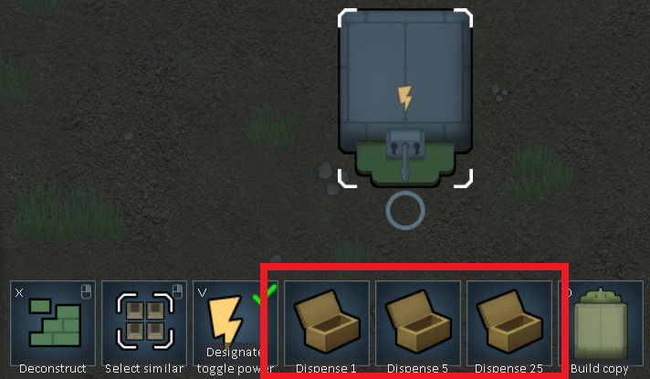

# BetterNutrientPasteDispenserControls

This is a mod for the game RimWorld by Ludeon Studios.

The mod adds buttons to manually dispense from a Nutrient Paste Dispenser.

# Table of Contents

* [Introduction](#introduction)
* [Links](#links)
* [Explanation](#explanation)

# Introduction

The mod adds buttons to manually dispense from a Nutrient Paste Dispenser.

When you select a Nutrient Paste Dispenser, you'll see widget buttons to "Dispense 1", "Dispense 5", and "Dispense 25".

This offers a more convenient alternative to the weird vanilla thing where you restrict a pawn at the spot and spam the draft button.

# Links

We're on Steam: https://steamcommunity.com/sharedfiles/filedetails/?id=2324531554

We're on GitHub: https://github.com/maarxx/BetterNutrientPasteDispenserControls

For reporting bugs or requesting features, Github Issues are better than Steam Workshop Comments.

# Explanation

